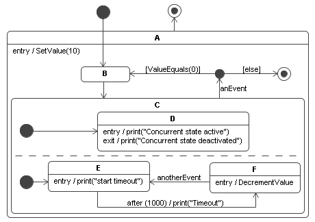

# Example of Statechart: Getting started

This introduction should help you to understand how to use the framework. Mainly the following steps are necessary:

- Model the diagram with your favorite PlantUML or Mermaid tool.
- If needed, derive a `Parameter` subclass to store your runtime-specific data.
- Create your implementation of the actions, guards and events.
- Code your diagram using the framework classes.
- Dispatch the events on the statechart.

These steps are described in detail in the next sections. As a basis the following statechart is used to create the code for:



The full runnable C++ source matching this walkthrough lives at [`doc/getting-started.cpp`](getting-started.cpp); the snippets below are excerpts of that file.

## Creating your parameter, actions, events and guards

After the diagram is modelled we need to recognize the runtime-specific data we are using. In this example we need to store an integer-value which is decremented every time the state `F` is activated. All your data is stored in a separate object so that the infrastructure of the statechart can be used by more than one thread. The class derives from `statechart::Parameter`:

```cpp
class MyParameter : public statechart::Parameter {
public:
    int value = 0;
};
```

**Warning:** never store data which will be modified by your actions and guards in members shared between threads — they may be accessed concurrently.

### Events

Events are represented by the base class `statechart::Event`. Creating one usually means deriving a tiny class with a stable identifier; the default `equals()` matches by identifier string.

```cpp
class AnEvent : public statechart::Event {
public:
    AnEvent() : statechart::Event("AnEvent") {}
};
```

You may notice that we did not specify the time event used in the concurrent-state. As you will see later, this is not necessary — the framework provides `statechart::TimeoutEvent`.

### Actions

`Action` is a `std::function<void(Metadata&, Parameter&)>` alias, so any callable works. The example builds them as factory functions returning lambdas:

```cpp
statechart::Action setValue(int value) {
    return [value](statechart::Metadata&, statechart::Parameter& p) {
        static_cast<MyParameter&>(p).value = value;
    };
}

statechart::Action decrementValue() {
    return [](statechart::Metadata&, statechart::Parameter& p) {
        --static_cast<MyParameter&>(p).value;
    };
}

statechart::Action print(std::string message) {
    return [msg = std::move(message)](statechart::Metadata&, statechart::Parameter&) {
        std::cout << msg << '\n';
    };
}
```

When dispatching an event you can use the parameter class (or exactly a derivation of it) to send call-parameters to the action. An action **must never dispatch a synchronous event** on the statechart — it would lead to undefined behaviour. Use `statechart.dispatchAsynchron(...)` instead.

### Guards

`Guard` is a `std::function<bool(Metadata&, Parameter&)>` alias. The guard must:

- Never modify the parameter or metadata.
- Always return a boolean expression.

```cpp
statechart::Guard valueEquals(int value) {
    return [value](statechart::Metadata&, statechart::Parameter& p) {
        return static_cast<MyParameter&>(p).value == value;
    };
}
```

The `else`-guard is just a `meta`-guard: it is only shown in the diagram but not represented in the implementation. Every transition with an `else`-guard simply has no guard in code.

## Building the statechart

After the specific elements are created we can start building the statechart itself. The main idea is to start with the statechart object and then create all substates in a top-down way. Every state owns no allocation: the `Statechart` is the *arena* and hands out raw non-owning pointers via the `create<T>(...)` factory.

When you allocate the statechart you can specify the number of worker threads for the `event`- and `timeout-event`-queue. The main difference is that the event-queue implements a FIFO handling and serialises one event per metadata at a time, while the timeout-queue is internally used for the time-event semantics. Activating a state automatically schedules its outgoing timeout-events; deactivating cancels them.

```cpp
auto chart = std::make_unique<statechart::Statechart>("example", 2, false);

// Top-level pseudo-states.
auto* state_start = chart->create<statechart::PseudoState>("start", chart.get(), statechart::PseudoStateType::Start);
auto* state_final = chart->create<statechart::FinalState>("final", chart.get());

// Hierarchical OR-state initialising the user value to 10.
auto* state_a = chart->create<statechart::HierarchicalState>("a", chart.get(), setValue(10), statechart::Action{}, statechart::Action{});

// Substates of state_a.
auto* state_b = chart->create<statechart::State>("b", state_a);
auto* state_j = chart->create<statechart::PseudoState>("j", state_a, statechart::PseudoStateType::Junction);
auto* state_a_final = chart->create<statechart::FinalState>("a_final", state_a);
auto* state_c = chart->create<statechart::ConcurrentState>("c", state_a);

// Region 1.
auto* state_c_r1 = chart->create<statechart::HierarchicalState>("c_r1", state_c);
auto* state_c_r1_start = chart->create<statechart::PseudoState>("c_r1_start", state_c_r1, statechart::PseudoStateType::Start);
auto* state_d = chart->create<statechart::State>("d", state_c_r1, print("c_r1 active"), statechart::Action{}, print("c_r1 inactive"));

// Region 2.
auto* state_c_r2 = chart->create<statechart::HierarchicalState>("c_r2", state_c);
auto* state_c_r2_start = chart->create<statechart::PseudoState>("c_r2_start", state_c_r2, statechart::PseudoStateType::Start);
auto* state_e = chart->create<statechart::State>("e", state_c_r2, print("start timeout"));
auto* state_f = chart->create<statechart::State>("f", state_c_r2, decrementValue());
```

After all states are created we must create the transitions. It is important that you create the transitions after the states because the transition constructor needs the state hierarchy.

```cpp
chart->createTransition(state_start, state_b);
chart->createTransition(state_b, state_c);
chart->createTransition(state_c_r1_start, state_d);
chart->createTransition(state_c_r2_start, state_e);
chart->createTransition(state_e, state_f, chart->createEvent<statechart::TimeoutEvent>(1000), print("timeout"));
chart->createTransition(state_f, state_e, chart->createEvent<AnotherEvent>());
chart->createTransition(state_c, state_j, chart->createEvent<AnEvent>());
chart->createTransition(state_j, state_b, valueEquals(0));
chart->createTransition(state_j, state_a_final);
chart->createTransition(state_a, state_final);
```

That is all you have to do to implement the statechart. The next section explains how to use it.

## Usage

The created instance of the statechart can now be used for dispatching events. It is possible to use the same statechart instance with more than one metadata object. We need to create a `Parameter` and a `Metadata` and then trigger events. You can choose between using the event queue or not. When a new metadata object is created you must call `start` before dispatching events.

```cpp
MyParameter parameter;
statechart::Metadata data;

chart->start(data, parameter);
```

A call of the `dispatch` (and `start`) method returns only when a state is reached where no outgoing transition can trigger. In our example this is the case with state `e`: `start` triggers a timeout-event internally and then returns. After sleeping at least 1 second `e` is deactivated and `f` activated. Then we trigger an event:

```cpp
std::this_thread::sleep_for(std::chrono::milliseconds{1500});
AnEvent ev;
chart->dispatch(data, &ev, parameter);
```

This is all we do for dispatching events. If you want to use the event queue, just call the asynchronous variants:

```cpp
chart->startAsynchron(data, std::make_shared<MyParameter>(parameter));
chart->dispatchAsynchron(data, std::make_shared<AnEvent>());
```
